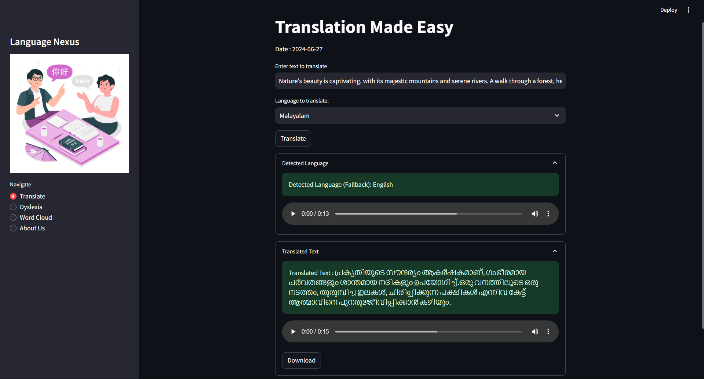
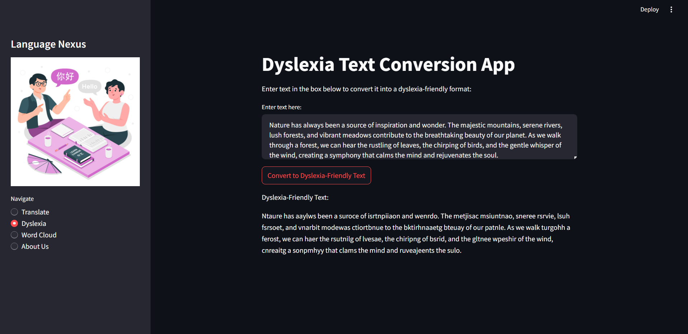
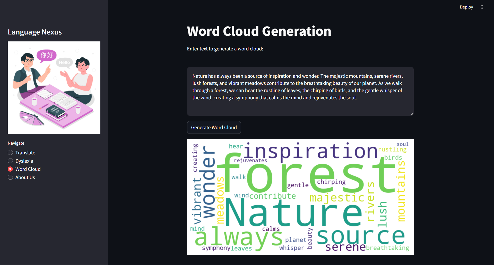
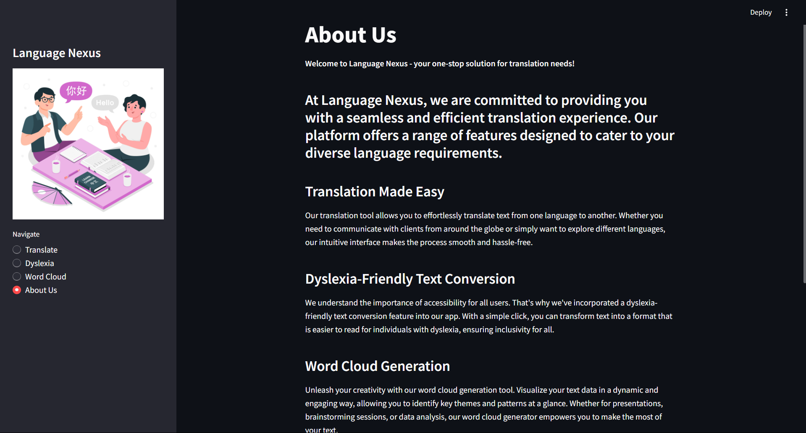

# Language Nexus

Welcome to Language Nexus, your one-stop solution for translation needs! This application is built using Streamlit and provides multiple features such as translation, dyslexia-friendly text conversion, and word cloud generation.

## Features

1. **Translate**: Translate text between different languages using Google Translate API. It also provides audio for both the original and translated text.
2. **Dyslexia-Friendly Text Conversion**: Convert text into a format that is easier to read for individuals with dyslexia.
3. **Word Cloud Generation**: Generate word clouds from the provided text to visualize key themes and patterns.
4. **About Us**: Information about Language Nexus and the team.

## Getting Started

### Prerequisites

- Python 3.6 or higher
- A virtual environment

### Installation

1. **Clone the repository**:
    ```sh
    git clone https://github.com/VishnuSwaroop-PS/LanguageNexus.git
    cd LanguageNexus
    ```

2. **Create a virtual environment**:
    ```sh
    python -m venv env
    source env/bin/activate  # On Windows, use `env\Scripts\activate`
    ```

3. **Install the required packages**:
    ```sh
    pip install -r requirements.txt
    ```

4. **Run the application**:
    ```sh
    streamlit run translator.py
    ```

## Dependencies

- `streamlit==1.5.0`
- `Pillow==9.0.0`
- `gtts==2.2.2`
- `googletrans==4.0.0-rc1`
- `numpy==1.22.0`
- `wordcloud==1.8.1`
- `matplotlib==3.5.1`

## File Structure

- `translator.py`: The main source code file containing the implementation of the Language Nexus application.
- `requirements.txt`: The file containing all the dependencies required to run the application.
- `image.jpg`: An image used in the sidebar.
- `readme.md`: This README file.

## Usage

### Translation

1. Enter the text you want to translate in the input box.
2. Select the target language from the dropdown list.
3. Click the "Translate" button to see the translated text and hear the audio.

### Dyslexia-Friendly Text Conversion

1. Enter the text you want to convert in the text area.
2. Click the "Convert to Dyslexia-Friendly Text" button to see the converted text.

### Word Cloud Generation

1. Enter the text for which you want to generate a word cloud.
2. Click the "Generate Word Cloud" button to see the word cloud visualization.

## Example Screenshots

## Translate Page


## Dyslexia Page


## Word Cloud Page


## About Us Page


## Contributing

Contributions are welcome! Please fork the repository and submit a pull request for any changes you would like to make.

1. Fork the repository
2. Create a new branch: `git checkout -b my-feature-branch`
3. Make your changes and commit them: `git commit -m 'Add some feature'`
4. Push to the branch: `git push origin my-feature-branch`
5. Submit a pull request

## License

This project is licensed under the MIT License. See the `LICENSE` file for details.

## Contact

For any questions or suggestions, feel free to contact me at https://www.linkedin.com/in/vishnu-swaroop-p-s-64590b1ab/.

---

Thank you for using Language Nexus!

---

